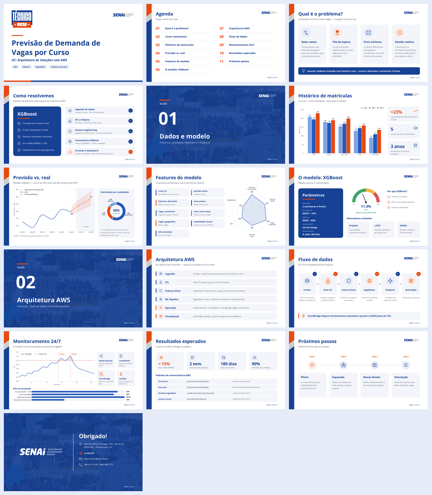
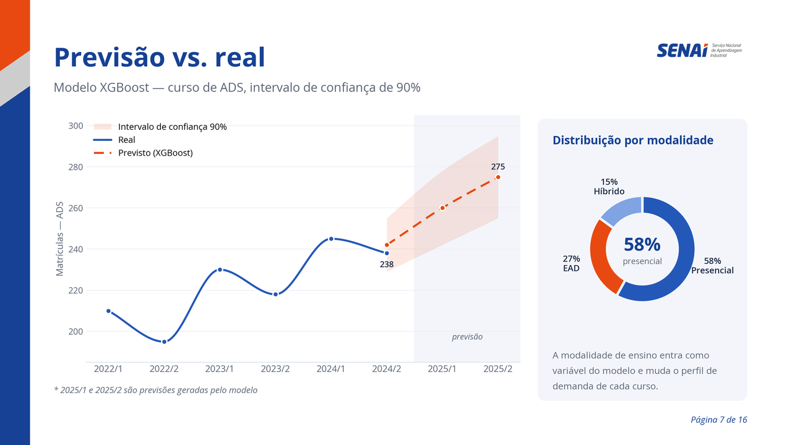
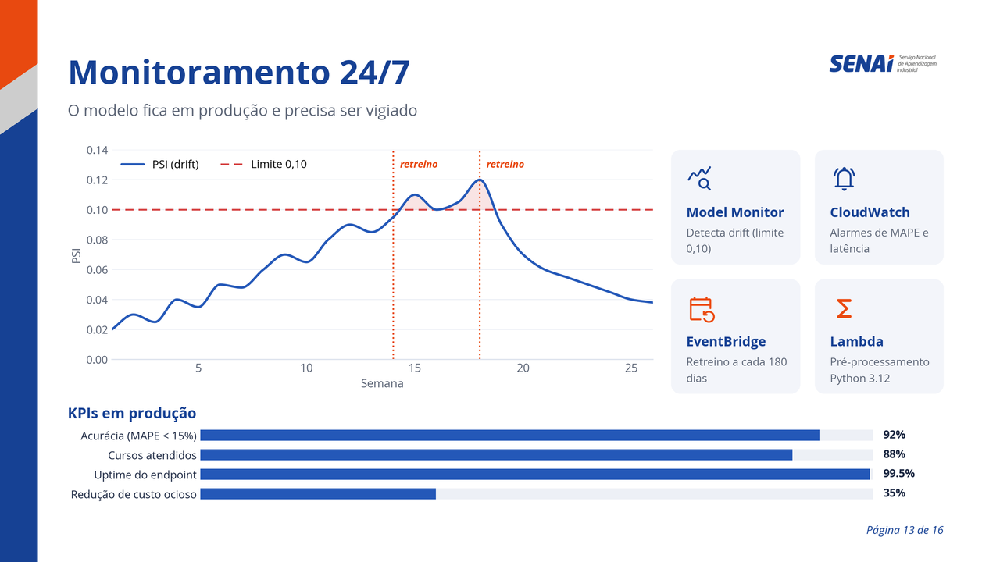
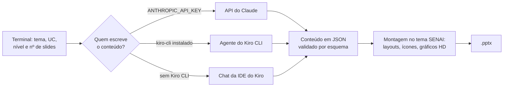

# Geração de Slides SENAI

Geradores de apresentações PowerPoint no padrão visual **SENAI 2026**, construídos
a partir do modelo oficial `assets/Modelo Senai 2026 - Indentidade Nova.pptx`.
Um comando no terminal pergunta o que você precisa e entrega um `.pptx` pronto para
apresentar, com capa, agenda, seções, conteúdo, gráficos em HD e encerramento.


São dois geradores:

| Script | Para quê | Conteúdo escrito por |
| --- | --- | --- |
| [`gerar_slides.py`](gerar_slides.py) | Apresentação do caso de uso deste projeto (previsão de matrículas com XGBoost na AWS) | Fixo no código |
| [`gerar_tema.py`](gerar_tema.py) | Apresentação sobre **qualquer tema** informado no terminal | Claude (API) ou agente do Kiro |

## Resultados

Os arquivos abaixo estão em [`resultado-slide/`](../resultado-slide) e podem ser
baixados e abertos no PowerPoint. As imagens foram exportadas com
[`exportar_previa.py`](exportar_previa.py).

### Previsão de Demanda de Vagas por Curso

Gerado com `gerar_slides.py`, modo **aprofundado**, 16 slides.
Arquivo: [`previsao-matriculas.pptx`](../resultado-slide/previsao-matriculas.pptx)



<table>
  <tr>
    <td width="50%"><br><sub>Cartões com ícones Google Material Symbols</sub></td>
    <td width="50%"><br><sub>Gráficos em HD com curvas suaves e intervalo de confiança</sub></td>
  </tr>
  <tr>
    <td width="50%"><br><sub>Divisória de seção no padrão do modelo SENAI</sub></td>
    <td width="50%"><br><sub>Monitoramento com gráfico de drift e barras de KPI</sub></td>
  </tr>
</table>

### Candelabro

Gerado com `gerar_tema.py`, conteúdo escrito pelo **agente do Kiro**, modo
**resumido**, 5 slides (tema "candelabro", UC "item de casa").
Arquivo: [`candelabro.pptx`](../resultado-slide/candelabro.pptx)


## Como funciona



1. **Perguntas.** O script pergunta o tema, a unidade curricular (opcional), o nível
   de detalhe (resumido ou aprofundado) e quantos slides.
2. **Roteiro.** A quantidade de slides é distribuída entre capa, agenda, divisórias de
   seção, conteúdo e encerramento.
3. **Conteúdo.** No `gerar_tema.py`, o Claude ou o Kiro escreve títulos, textos,
   ícones, dados de gráficos e notas do apresentador em JSON. O JSON é validado:
   layout, ícones (só nomes existentes no Material Symbols) e estrutura.
4. **Montagem.** Cada slide é desenhado com os componentes do tema. Textos longos
   têm a fonte reduzida até caberem na caixa; gráficos são renderizados no tamanho
   exato da área, em 300 dpi.

## Identidade visual

Extraída do modelo oficial SENAI 2026:

- **Tipografia:** Open Sans (Google Fonts), a mesma do modelo
- **Ícones:** Material Symbols Rounded (Google Fonts), sem emojis
- **Cores:** azul SENAI `#164194` e laranja `#E84910`
- **Logos:** `assets/senai.png` e `assets/técnico.png`
- **Slides de conteúdo:** fundo branco, faixa vertical laranja/cinza/azul à esquerda,
  logo no canto superior direito e "Página X de Y"
- **Divisórias e encerramento:** fundo azul com a colagem de fotos do modelo em baixa opacidade
- **Gráficos:** paleta validada para daltonismo, rótulos com valores e fonte dos dados
- **Apresentação:** transição fade entre slides e entrada animada dos gráficos

## Instalação

A partir da raiz do projeto:

```bash
pip install -r requirements.txt
```

Na primeira execução no Windows, a Open Sans é instalada só para o usuário atual
(sem administrador), para o PowerPoint exibir a tipografia correta. Fontes e ícones
que faltarem são baixados do Google Fonts automaticamente.

## `gerar_slides.py` — previsão de matrículas

```bash
python slides/gerar_slides.py                               # pergunta no terminal
python slides/gerar_slides.py --slides 10 --modo resumido   # sem perguntas
```

- **Resumido:** frases curtas, foco nos visuais (3 a 17 slides)
- **Aprofundado:** explicações, detalhes técnicos, notas do apresentador e slide de
  próximos passos (3 a 18 slides)

Com poucos slides entram primeiro os mais importantes; com mais slides entram a
agenda e as divisórias de seção. Saída: `slides/previsao-matriculas.pptx`.

## `gerar_tema.py` — qualquer tema

```bash
python slides/gerar_tema.py                                 # pergunta no terminal
python slides/gerar_tema.py --tema "Energia solar" --uc "Instalações Elétricas" --slides 10 --modo aprofundado
```

### Quem escreve o conteúdo

| Situação | O que acontece |
| --- | --- |
| `ANTHROPIC_API_KEY` definida | Usa a API do Claude (`claude-opus-5`) |
| Sem chave, com Kiro CLI (`kiro-cli`) instalado | Roda o agente do Kiro no terminal e monta o `.pptx` em seguida (requer `KIRO_API_KEY`) |
| Sem chave e sem Kiro CLI | Abre o chat do Kiro na IDE e aguarda o agente salvar o conteúdo |

Use `--kiro` para forçar o Kiro mesmo com a chave da API definida. Se o conteúdo
vier com erro de validação, o Kiro é chamado de novo para corrigir (até 2 vezes).

### Layouts

| Layout | Uso |
| --- | --- |
| `topicos` | 3 a 6 conceitos com ícone, título e texto |
| `cartoes` | 2 a 4 cartões lado a lado |
| `numeros` | 2 a 4 indicadores em destaque |
| `processo` | 3 a 6 etapas em sequência |
| `linha_do_tempo` | 3 a 5 marcos |
| `comparacao` | duas colunas lado a lado |
| `grafico` | barras, barras horizontais, linhas ou rosca, com leituras ao lado |
| `destaque` | frase de impacto |
| `tabela` | até 5 colunas e 8 linhas |

Números e gráficos sempre trazem a fonte; valores aproximados aparecem como
"Dados ilustrativos". Revise os dados antes de apresentar.

### Saída e reuso

As apresentações vão para `slides/apresentacoes/` (ignorada pelo git):

- `<tema>.pptx`: a apresentação
- `<tema>.json`: o conteúdo, editável
- `<tema>.prompt.md`: instruções entregues ao Kiro, quando ele é usado

Para montar de novo depois de editar o JSON, sem nova chamada à IA:

```bash
python slides/gerar_tema.py --de-json slides/apresentacoes/<tema>.json
```

## Exportar imagens dos slides

Gera um PNG por slide e uma visão geral (`grade.png`), como as deste README:

```bash
python slides/exportar_previa.py resultado-slide/candelabro.pptx
```

Saída: `resultado-slide/previa/candelabro/`. Não precisa de PowerPoint nem LibreOffice.

## Opções comuns

| Opção | Descrição |
| --- | --- |
| `--dpi N` | Resolução dos gráficos (padrão 300) |
| `--saida caminho.pptx` | Caminho do arquivo gerado |
| `--sem-instalar-fontes` | Não instala a Open Sans no Windows do usuário |
